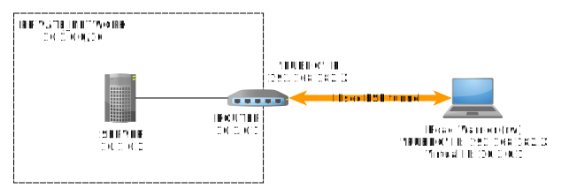

# Excercise: AAA with FreeRADIUS

# Introduction

We will set up a radius server instance using FreeRADIUS.

First, lets use the `isp` image to install all required software and then clone it two times.

    sudo apt update
    sudo apt install freeradius freeradius-utils apache2 libapache2-mod-auth-radius wireshark

During wireshark installation when asked `Should non-superusers be able to capture packets?`, select `yes`. (If you make a mistake and select `no`, you can change your selection by running `sudo dpkg-reconfigure wireshark-common`.) Then add your user to the group `wireshark` with the following command: `sudo usermod -a -G wireshark $USER`.

Power-off `isp` machine. Configure it to have a single NIC: go to `Machine > Settings > Network` and disable all Adapters except `Adapter 1`. Set it to either `Bridged` or `NAT network` (do not use `NAT`).

Create two linked clones. Do not forget to reinitialize the MAC addresses. Name the clones `radius1` and `radius2`.

# Exercises

We will work with `radius1` in the first and the second exercise. The third exercise requires both machines.

## Radius server with a test client

Start `radius1`.

First, let's register a new client (network access server, NAS) to the Radius server. Open `/etc/freeradius/3.0/clients.conf` and make sure it contains the following entry. (The entry should already be there, this is just to be sure.)

    client localhost {
        ipaddr = 127.0.0.1
        secret = testing123
        require_message_authenticator = no
        nas_type = other
    }

Next, let's add a new supplicant (end-user) to the database. We'll manage the database in a file. Open `/etc/freeradius/3.0/users` and add the lines below.

    "alice" Cleartext-Password := "password"

By default, the FreeRADIUS is running as a background service. But for testing purposes, it is better we start it in the foreground with all debugging turned on.

First, stop the service with `sudo service freeradius stop`.

It may be best that you start FreeRADIUS in a new terminal window, or alternatively, in a new tab of the existing terminal widow by pressing `ctrl+shift+t`. This will allow you to monitor the output of the server, while also give you the ability to run additional commands. Start the server in the foreground with all logging and debugging turned on: `sudo freeradius -X -d /etc/freeradius/3.0`.

You can kill the server at any time by pressing `ctrl+c`.

Finally, to test whether the radius can successfully respond to requests, use the command-line NAS client and send an authentication request.

`echo "User-Name=alice, User-Password=password" | radclient 127.0.0.1 auth testing123 -x`

Observe the output console of the AAA server and the the NAS client. Open Wireshark and observe messages that get exchanged. Use the `radius` filter. Note RADIUS messages, such as Access-Request, Access-Accept, Access-Reject and inspect Attribute Value Pairs (AVP) that carry RADIUS data.

## Exercise 2: HTTP Basic authentication with Apache and FreeRADIUS

In the second exercise, we shall configure an actual network access server (NAS) that has to authenticate users. The role of NAS will be enacted by the Apache HTTP server: users will have to log-in if they want see pages served by Apache HTTP server.

First, enable `auth_radius` module for apache and restart the apache server.

    sudo a2enmod auth_radius
    sudo service apache2 restart

Next, configure Apache Radius settings in `/etc/apache2/ports.conf`. Add the following lines.

    # FreeRADIUS runs on localhost:1812 (standard RADIUS port).
    # Apache will authenticate itself to the AAA server with PSK 'testing123'.
    # The request shall time-out after 5 seconds, and retry at most 3 times.
    AddRadiusAuth localhost:1812 testing123 5:3

    # Next line configures the time (in minutes) in which the authentication cookie
    # set by the Apache server expires
    AddRadiusCookieValid 1

Next, tell Apache which pages require authentication. Open `/etc/apache2/sites-available/000-default.conf` and add the following lines inside `<VirtualHost *:80>` block. (Since, folder `/var/www/html` represents Apache's HTTP root folder, this in effect covers all pages.)

    <Directory /var/www/html>
        Options Indexes FollowSymLinks MultiViews
        AllowOverride None

        # ADD LINE 1
        # Use basic password authentication
        # AuthType Digest won't work with RADIUS
        AuthType Basic

        # ADD LINE 2
        # Tell the user the realm to which they are authenticating.
        AuthName "RADIUS Authentication for my site"

        # ADD LINE 3
        # Set RADIUS to be provider for this basic authentication
        AuthBasicProvider radius

        # ADD LINE 4
        # Require that mod_auth_radius returns a valid user,
        # otherwise access is denied.
        Require valid-user
    </Directory>

Reload Apache's configuration file with `sudo service apache2 reload`.

Finally, start the FreeRADIUS server in the foreground with `sudo freeradius -X -d /etc/freeradius/3.0`.

Test whether the scenario works. Open a web browser and navigate to `http://localhost`. The browser should require you log-in. Use alice's credentials.

As before, observe AAA server console output and exchanged messages using wireshark.

**Hint.** If you are using a normal browser, make use of private browsing for fast log-outs; you simply close the window. Alternatively, you can test using the terminal.

`curl --user alice:password http://localhost -v`

The switch `-v` stands for verbose and it causes `curl` to display HTTP headers.

## Exercise 3: Roaming and federation

Start `radius2`. Assert the IP addresses of both machines. Let `$RADIUS1` and `$RADIUS2` denote the IP addresses of `radius1` and `radius2`, respectively.

On `radius1`, create a new domain (or realm) called `domain.com`. Open `/etc/freeradius/3.0/proxy.conf` and add the following.

    home_server hs_domain_com {
            type = auth+acct
            ipaddr = $RADIUS2
            port = 1812
            secret = testing123
    }

    home_server_pool pool_domain_com {
            type = fail-over
            home_server = hs_domain_com
    }

    realm domain.com {
            pool = pool_domain_com
            nostrip
    }

On `radius2`, create a new (local) domain called `domain.com`. Open `/etc/freeradius/3.0/proxy.conf` and add the following two lines.

    realm domain.com {
    }

On `radius2`, define a new AAA client (AAA proxy) and define its credentials. Open `/etc/freeradius/3.0/clients.conf` and add the following lines.

    client $RADIUS1 {
        secret = testing123
    }

On `radius2`, create a new supplicant (end-user). Open `/etc/freeradius/3.0/users` and define his or hers credentials. An instance is given below. Make sure the second line is tab-indented.

    "bob" Cleartext-Password := "password"

Everything should now be set up. Make sure the FreeRADIUS server is running on both machines and in both cases in the foreground with `sudo freeradius -X -d /etc/freeradius/3.0`.

If you get an error stating that the port is already taken, stop the running instance of the server. If it is running in the background, you can stop it with `sudo service freeradius stop`. If it is running in the foreground, navigate to the terminal that shows the server output console and press `ctrl+c`.

Use the first machine to test whether the scenario works. Open a web browser and navigate to `http://localhost`. The browser should require you log-in. This time, log-in with `bob@domain.com` and the appropriate password.

As before, observe AAA server console output and exchanged messages using Wireshark. Notice that in this case, the first AAA server, `radius1` acts as a proxy and forwards the auth-request to the second AAA server, `radius2` which finally authenticates the user.

**Hint.** If you are using a normal browser, make use of private browsing for fast log-outs -- to log-out simply close the window. Alternatively, you can test using the terminal `curl --user bob@domain.com:password http://localhost -v`

## Questions

*   **Question 1.** Which AVPs are sent from the Apache to Radius server when Alice tries to log in? Use Wireshark to inspect radius messages; use filter `radius` to limit the output only to radius messages.
*   **Question 2.** Which additional AVPs are added to the `Access-Request` message, when the (local) Radius server proxies the `Access-Request` message to the Radius server that runs on `radius2`?
*   **Question 3.** What would you need to do, if you wanted `radius2` to also cover users from domain `example.org`?

## Optional assignment: authenticating IPsec roadwarriors with Radius

For homework assignment, set up a similar IPsec road-warrior scenario that you did in the previous week. Consider the following network and machines. (I strongly encourage you to complete the homework from the previous week before attempting this one, since this assignment builds on top of the previous one.)

(The majority of work will be done on the `rw` and `router`, the `server` is there mostly for the testng purposes.)

*   Set up a `router` that bridges the private (`10.1.0.0/16`) and the public (Internet) network.
*   Install a FreeRADIUS instance on the `router` and add a couple of users to its database. These will be username/password pairs used to authenticate the roadwarriors.
*   Configure the `router` to allow roadwarrior connections and authenticate roadwarriors with the help of Radius server. You'll find [this strongswan configuration example](https://www.strongswan.org/testing/testresults/ikev2/rw-eap-md5-radius) very helpful. Also consider the following:
    *   Authenticate the `router` with an arbitrary PSK and not with an RSA certificate. (The configuration example uses RSA certificate to authenticate the `router`. Change the `leftauth` from `pubkey` to `psk` and remove commands that are not needed for `psk`. Then define the PSK inside the `/etc/ipsec.secrets` file.)
    *   You'll have to install an additional package to connect Radius with strongswan: besides `strongswan freeradius freeradius-utils`, you'll also need to install the `libcharon-extra-plugins`. Then use file `/etc/strongswan.conf` to tell the StrongSwan how to connect to Radius. [See this example.](https://www.strongswan.org/testing/testresults/ikev2/rw-eap-md5-radius/moon.strongswan.conf)
    *   Roadwarriors should get virtual IPs from the `10.3.0.0/16` address space. [This example](https://www.strongswan.org/testing/testresults/ikev2/ip-pool/) demonstrates how to assign virtual IPs.
*   Set up a road warrior `rw` that connects to the private network by establishing a IPsec VPN tunnel to the `router`. You may use [the following example](https://www.strongswan.org/testing/testresults/ikev2/rw-eap-md5-radius) as a basis for you VPN connection.

Remember, you can run both daemons (strongswan and FreeRADIUS server) in the foreground to ease debugging:

*   `sudo freeradius -Xd /etc/freeradius`
*   `sudo ipsec start --nofork`

# Resources

*   [FreeRADIUS](http://freeradius.org)
