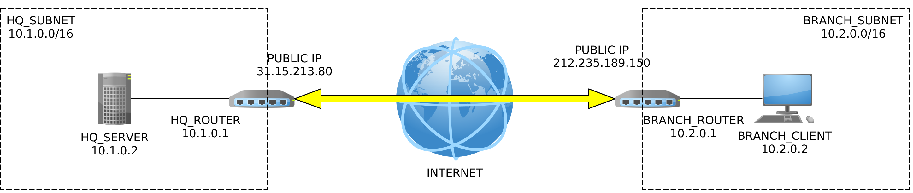

# Exercise: VPN with IPsec

## Intro

As part of setting up a company network infrastructure, we shall set up a tunneled VPN between the headquarters and its remote branch. The following picture illustrates the desired network.

To set-up the VPN, we will be using StrongSwan, which is an open-source implementation of IKE. Strong swan is an IKE keying daemon, that is, a program, running in a background, that sets up ISAKMP and IKE associations between various network points.

We will be needing four virtual machines: two routers and two hosts. The routers shall have two network interfaces, while the hosts shall have a single network interface each.

Let's first install all required software on our `isp` machine, and then clone it four times. During the lab session, the `isp` machine will not be running. We are merely using it as a template from which we shall create other machines.

## Preparing the `isp` machine

Start the `isp` machine and install StrongSwan suite and other packages.

    sudo apt update
    sudo apt install strongswan strongswan-pki libcharon-extra-plugins apache2 wireshark
    # strongswan-pki and libcharon-extra-plugins are needed for optional assignments

During wireshark installation when asked `Should non-superusers be able to capture packets?`, select `yes`. (If you make a mistake and select `no`, you can change your selection by running `sudo dpkg-reconfigure wireshark-common`.) Then add your user to the group `wireshark` with the following command: `sudo usermod -a -G wireshark $USER`.

Shut down the `isp` machine. Now, configure it to have 2 NICs: go to `Machine > Settings > Network`, and set the `Adapter 1` to `NAT Network`, and `Adapter 2` to `Internal-Network`. For now, it does not matter which internal network you select.

## Creating four virtual machines

Clone the `isp` machine four times. You may create linked clones. Do not forget to reinitialize the MAC addresses. Name the new machines as follows: `hq_router`, `branch_router`, `hq_server`, `branch_client`.

Now, got to network settings for each of new machines and do the following:

*   `hq_router`: Make sure the `Adapter 1` is set `NAT Network` and `Adapter 2` to `Internal-Network`. As the name of internal network provide `hq_subnet`.
*   `branch_router`: Make sure the `Adapter 1` is set `NAT Network` and `Adapter 2` to `Internal-Network`. As the name of internal network provide `branch_subnet`.
*   `hq_server`: Disable `Adapter 2`. Make sure the `Adapter 1` is set to `Internal-Network`. As the name of internal network provide `hq_subnet`.
*   `branch_client`: Disable `Adapter 2`. Make sure the `Adapter 1` is set to `Internal-Network`. As the name of internal network provide `branch_subnet`.

## Set up the headquarters

### Set upt `hq_router`

Start `hq_router`. Open `/etc/netplan/01-network-manager-all.yaml` and configure it to have a static network configuration for `enp0s8` and automatic (via DHCP) for `enp0s3`. The file should have the following contents:

    network:
      version: 2
      ethernets:
        enp0s3:
          dhcp4: true
          dhcp-identifier: mac
        enp0s8:
          addresses: [10.1.0.1/16]

Next, apply the changes with `sudo netplan apply` and assert that interface `enp0s8` has the correct IP by running `ip addr`.

Finally, enable packet forwarding with `echo 1 | sudo tee /proc/sys/net/ipv4/ip_forward`.

### Set up `hq_server`

Start `hq_server`. Open `/etc/netplan/01-network-manager-all.yaml` and configure it to have a static network configuration for `enp0s3`. The file should have the following contents:

    network:
      version: 2
      ethernets:
        enp0s3:
          addresses: [10.1.0.2/16]
          gateway4: 10.1.0.1
          nameservers:
            addresses: [8.8.8.8]

Apply the changes with `sudo netplan apply` and assert that interface `enp0s3` has the correct IP by running `ip addr`. Assert that you can ping the `hq_router` at `10.1.0.1`.

## Set up the branch

The procedure is exactly the same as with headquarters, but network addresses are a bit different.

### Set up `branch_router`

Start `branch_router`. Open `/etc/netplan/01-network-manager-all.yaml` and configure it to have a static network configuration for `enp0s8` and automatic (via DHCP) for `enp0s3`. The file should have the following contents:

    network:
      version: 2
      ethernets:
        enp0s3:
          dhcp4: true
          dhcp-identifier: mac
        enp0s8:
          addresses: [10.2.0.1/16]

Next, apply the changes with `sudo netplan apply` and assert that interface `enp0s8` has the correct IP by running `ip addr`.

Finally, enable packet forwarding with `echo 1 | sudo tee /proc/sys/net/ipv4/ip_forward`.

### Set up `branch_client`

Finally, start `branch_client`. Open `/etc/netplan/01-network-manager-all.yaml` and configure it to have a static network configuration for `enp0s3`. The file should have the following contents:

    network:
      version: 2
      ethernets:
        enp0s3:
          addresses: [10.2.0.2/16]
          gateway4: 10.2.0.1
          nameservers:
            addresses: [8.8.8.8]

Apply the changes with `sudo netplan apply` and assert that interface `enp0s3` has the correct IP by running `ip addr`. Assert that you can ping the `branch_router` at `10.2.0.1`.

### Checkpoint

Let's make a sanity check before continuing. Assure that you can do the following:

*   Send (and receive) pings between `hq_router` and `hq_server` (network `10.1.0.0/16`);
*   Send (and receive) pings between `branch_router` and `branch_client` (network `10.2.0.0/16`);
*   Send (and receive) pings between `hq_router` and `branch_router`. In this case, you should ping the _public_ addresses of `hq_router` and `branch_router`. By public, I refer to the IPs assigned to routers on the `enp0s3` interfaces. At university, these are the IP addresses from the `192.168.182.0/24`. (These are in fact **private** IP addresses, but if we were setting up a real network, they'd be public. So for pedagogical purposes, we'll pretend they are public.) From here on, I'll refer the the public IPs of the routers with `$HQ_IP` and `$BRANCH_IP` for the IPs of the `hq_router` and the `branch_router` respectively.

## Create a VPN IPsec tunnel

We now have two distinct networks, one at the headquarters and the other at the branch location. In the next step, we will configure a VPN tunnel between the two routers that will in turn connect the two networks. This will allow communication between machines regardless of the company network they are on: be it headquarters or branch.

### Set upt the `hq_router`

At the `hq_router` open the `/etc/ipsec.conf` and fill it with the following content.

    config setup

    conn %default
            ikelifetime=60m
            keylife=20m
            rekeymargin=3m
            keyingtries=1
            keyexchange=ikev2
            authby=secret

    conn net-net
            leftsubnet=10.1.0.0/16
            leftfirewall=yes
            leftid=@hq
            right=$BRANCH_IP
            rightsubnet=10.2.0.0/16
            rightid=@branch
            auto=add

Next, open file `/etc/ipsec.secrets` and add the following line.

    @hq @branch : PSK "secret"

Routers will be using a pre-shared key (PSK) to authenticate each other. The key is set to `secret`.

Finally, restart the IPsec `sudo ipsec restart` so that the changes get loaded.

### Set up the `branch_router`

Now, switch to `branch_router` machine, and perform a similar task: open file `/etc/ipsec.conf` and fill it with the following.

    config setup

    conn %default
            ikelifetime=60m
            keylife=20m
            rekeymargin=3m
            keyingtries=1
            keyexchange=ikev2
            authby=secret

    conn net-net
            leftsubnet=10.2.0.0/16
            leftid=@branch
            leftfirewall=yes
            right=$HQ_IP
            rightsubnet=10.1.0.0/16
            rightid=@hq
            auto=add

Then, open file `/etc/ipsec.secrets` and add the following line.

    @hq @branch : PSK "secret"

Finally, restart the IPsec `sudo ipsec restart` so that the changes get loaded.

### Establish the VPN link

Now that both routers are configured, we can bring up the VPN tunnel. You can see the IPsec settings on both, the `hq_router` and the `branch_router`, by running `sudo ipsec status[all]`. To establish the tunnel, invoke `sudo ipsec up net-net` on either routher (but only on one). Hopefully, the tunnel should be up and running. If not, try to debug and ask for help, if you get stuck.

A good debugging approach is to run the strongswan daemon in the foreground and have it print all debuging information to the standard output. You can achieve this with the following command: `sudo ipsec start --nofork`. To exit, press `ctrl+c`; this, however, stops the strongswan daemon and terminates all VPN connections. Thus if you want to run additional commands, you better open another terminal.

If everything went well, switch to `branch_client` and try to ping the `hq_server`. Or any other combination of machines should work.

If the tunnel was successfully set up but you are stil unable to exchange pings, assert that the forwarding is enabled on both routers.

If that does not help, you may have to explicitly set the source IPs from which the pings are set. For instance, to ping `branch_router` from `hq_router`, run `ping -I 10.1.0.1 10.2.0.1`.

Wow. This was long. If you made it, congratulations. If not, be persistent, read documentation (see links below) and ask TA (or colleagues) for help.

## Lab sessions exercises

1.  Run Wireshark on either router. Observe ISAKMP, ICMP and ESP traffic: in filter textbox, put the following: `isakmp || esp || icmp`.
2.  Restart strongSwan with `sudo ipsec restart`
3.  Observe secure Security Association (SA) establishment (IKE PHASE 1) and secure Key Exchange (IKE PHASE 2)
    1.  via Wireshark
    2.  via auth.log: `tail -f -n 0 /var/log/auth.log`
4.  Observe ISAKMP populated Security Policy Database: `sudo ip xfrm policy`
5.  **Question 1.** Observe established Secure Association Database and find out the Security Parameter Indexes (SPIs) that are associated with the tunnel: `sudo ip xfrm state`. Why are there two SPIs?
6.  Which cipher suites are being used? Run `sudo ipsec statusall` to find out. Now change the configuration files `/etc/ipsec.conf` on **both routers** so that the the ESP and the IKE traffic will be secured with the following cipher suite: `AES_GCM_16_256`. You may find [this StrongSwan example](https://www.strongswan.org/testresults4.html) useful.
7.  Ping remote machine again and observe Enapsulated Security Payload (IPsec) protocol in Wireshark: `ping -c 3 10.2.0.1`.
8.  **Question 2.** While `hq_server` and `branch_client` can talk to each other, they are unable to access the Internet. Why? How do we fix this? Remember what we did in the second lab session where we had a similar problem.
9.  **Question 3.** Run `mtr 10.2.0.2` on the `hq_server` and explain the output. How would the output change if `hq_router` and `branch_router` would not be directly connected -- let's say there were 10 network hops apart?

## Optional assignments

### Creating certificates

Instead of using pre-shared key, secure the tunnel between routers with digital certificates. You'll need to install an additional tool for generating certificates: `sudo apt install strongswan-pki`.

(The entire procedure for creating the certificate files--creating the CA, client certificates and moving the files into appropriate directories--is described in [StrongSwan documentation.](https://wiki.strongswan.org/projects/strongswan/wiki/SimpleCA))

First, you will create a certification authority (CA) that will issue client certificates.

Second, you will create two client certificates (for routers). When you create them, make sure you provide _subjectAltName_ that is exactly the same as the identity you use in the `/etc/ipsec.conf` files.

For instance, when creating the certificate for the branch router (whose identity is `@branch`), you can use the following command: `ipsec pki --pub --in branchKey.der | ipsec pki --issue --cacert caCert.der --cakey caKey.der --dn "C=SL, O=FRI-UL, CN=branch" --san @branch > branchCert.der`. (This command assumes that you have previously created the private key in file `branchKey.der` and that the CA's certificate and the corresponding private key are in files `caCert.der` and `caKey.der`.)

Next, copy the client's certificate and private key to the appropriate machines. Additionally, you will also have to copy the CA's certificate to both machines. Place files in the appropriate subfolders within `/etc/ipsec.d/`.

Finally, you will have to update the `/etc/ipsec.{conf,secrets}` files on both machines to use certificates. See [this StrongSwan example.](https://www.strongswan.org/testing/testresults/ikev2/net2net-cert/)

### Road Warriors

On the `hq_router`, create a new IPsec connection that enables _RoadWarrior_ scenarios, that is, allow remote users to connects to company's intranet. Such clients should receive a virtual IP from the `10.3.0.0/16` network.

For hints, see the StrongSwan examples. Note that _RoadWarriors_ should be able to reach both networks (`10.1.0.0/16` and `10.2.0.0/16`) as well as other _RoadWarriors_ (`10.3.0.0/16`). To achieve this, you'll have to set the `left|rightsubnet` values appropriately. (Hint: you can set multiple CIDR values, if you separate them with a comma -- for instance: `leftsubnet=10.1.0.0/16,10.2.0.0/16`.)

As an additional hint, on a working set-up that involves a tunnel between the `@hq` and the `@branch` and two road warriors (`@alice` and `@bob`), running `sudo ipsec status` run on `@hq` should return something like this (the _public_ IPs may be different in your case):

    Security Associations (3 up, 0 connecting):
              rw[3]: ESTABLISHED 62 seconds ago, 192.168.1.68[hq]...192.168.1.71[alice]
              rw{3}:  INSTALLED, TUNNEL, reqid 3, ESP SPIs: c217993d_i c9db6bdd_o
              rw{3}:   10.0.0.0/14 === 10.3.0.2/32
              rw[2]: ESTABLISHED 73 seconds ago, 192.168.1.68[hq]...192.168.1.72[bob]
              rw{2}:  INSTALLED, TUNNEL, reqid 2, ESP SPIs: c2562b42_i c7e8b710_o
              rw{2}:   10.0.0.0/14 === 10.3.0.1/32
         net-net[1]: ESTABLISHED 108 seconds ago, 192.168.1.68[hq]...192.168.1.70[branch]
         net-net{1}:  INSTALLED, TUNNEL, reqid 1, ESP SPIs: cbd54125_i cdaf6282_o
         net-net{1}:   10.1.0.0/16 10.3.0.0/16 === 10.2.0.0/1

The following configurations might be a good starting point:

*   [Remote access with PSK](https://www.strongswan.org/testing/testresults/ikev2/rw-psk-ipv4/)
*   [Remote access with X.509 and virtual IPs](https://www.strongswan.org/testing/testresults/ikev2/ip-pool/)

## Resources

We have barely scratched the surface of StrongSwan. To get a better grip of it, read the StrongSwan documentation. The introduction to StrongSwan is highly recommended.

### StrongSwan

*   [StrongSwan Introduction](https://wiki.strongswan.org/projects/strongswan/wiki/IntroductionTostrongSwan): I **heavily recommend** reading this document.
*   [Many, many, many StrongSwan configuration examples.](https://wiki.strongswan.org/projects/strongswan/wiki/IKEv2StrokeExamples) In particular, [Site-to-Site with PSK authentication](https://www.strongswan.org/uml/testresults/ikev2/net2net-psk/) is similar to our lab example.

### IPsec

*   [Cisco: VPNs and VPN technologies](http://www.ciscopress.com/articles/article.asp?p=24833)
*   [The TCP/IP Guide: IPsec](http://www.tcpipguide.com/free/t_IPSecurityIPSecProtocols.htm)
*   [Friedl, An Illustrated Guide to IPsec](http://www.unixwiz.net/techtips/iguide-ipsec.html)
